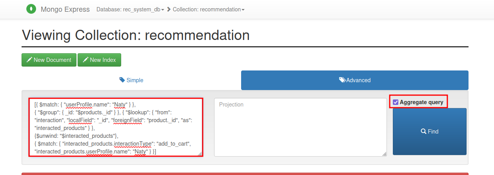

# Recommendation system database model

Modelagem e implementação de um banco de dados orientado a documentos (mongodb) para um sistema de recomendação fictício.

## O que tem neste repo?
 - Tem um drawio com uma arquitetura geral do fluxo de recomendação e o a modelagem conceitual, lógica e física do sistema de recomendação;
 - Tem um docker-compose para subir um mongodb com a implementação do modelo físico elaborado;
 
## Diagramas


## Subindo o banco de dados

> Nota: Para subir o banco de dados é necessário ter o Docker e Docker 
> Compose instalados e configurados.

Executar o comando: `docker compose up -d` para subir os container

## Acessando os dados

É possível interagir com mongodb pelo mongo-express. É possível acessá-lo pelo browser na url 
`http://localhost:8081`. O usuário e a senha estão presentes no docker-compose.yml (user: `user`, password: `pass`).
O database criado se chama `rec_system_db`. 

> O banco já vem com alguns dados fictícios que foram inicializados pelo script `create-schema.js`na raiz do projeto.


## Queries propostas

Abaixo possui alguns das queries relevantes ao modelo de banco de dados proposto para um o sistema de recomendação de um e-commerce.

```
//Query proposals:

//1 - Most viewed products and productCategory
db.interaction.aggregate([{ $match: { interactionType: "viewed"} }, { "$group": { _id: "$product", count: { $sum: 1 } } }]);//product

db.interaction.aggregate([{ $match: { interactionType: "viewed"} }, 
{ "$group": { _id: "$product.productCategoryId", count: { $sum: 1 } } }, 
{ "$lookup": { "from": "product_category", "localField": "_id", "foreignField": "_id", "as": "category" } }//look to "join" with productCategory 
]);//productCategory

//2 - Most added/removed to/from cart
db.interaction.aggregate([{ $match: { interactionType: "add_to_cart"} }, { "$group": { _id: "$product", count: { $sum: 1 } } }]);//added to cart
db.interaction.aggregate([{ $match: { interactionType: "removed_from_cart"} }, { "$group": { _id: "$product", count: { $sum: 1 } } }]);//removed from cart

//3 - Most favorited products
db.interaction.aggregate([{ $match: { interactionType: "favorited"} }, { "$group": { _id: "$product", count: { $sum: 1 } } }]);

//4 - UserProfile Most interacted Product Category
db.interaction.aggregate([{ $match: { "userProfile.name": "Will"} }, 
{ "$group": { _id: "$product.productCategoryId", count: { $sum: 1 } } },
{ "$lookup": { "from": "product_category", "localField": "_id", "foreignField": "_id", "as": "category" } }
]);

//5 - Recommendation that user add to cart
db.recommendation.aggregate([{ $match: { "userProfile.name": "Naty" } }, 
{ "$group": { _id: "$products._id" } }, { "$lookup": { "from": "interaction", "localField": "_id", "foreignField": "product._id", "as": "interacted_products" } }, 
{$unwind: "$interacted_products"}, 
{ $match: { "interacted_products.interactionType": "add_to_cart", "interacted_products.userProfile.name": "Naty" } }] );
```

> As queries podem ser executados no mongoexpress como na imagem abaixo:



Como mostrado na imagem acima para executar queries só é necessário especificar os argumentos do método. No caso é utilizado uma query com agregação, então é necessário estar
na aba `Advanced` e selecionar a opção `Aggregate query`.
